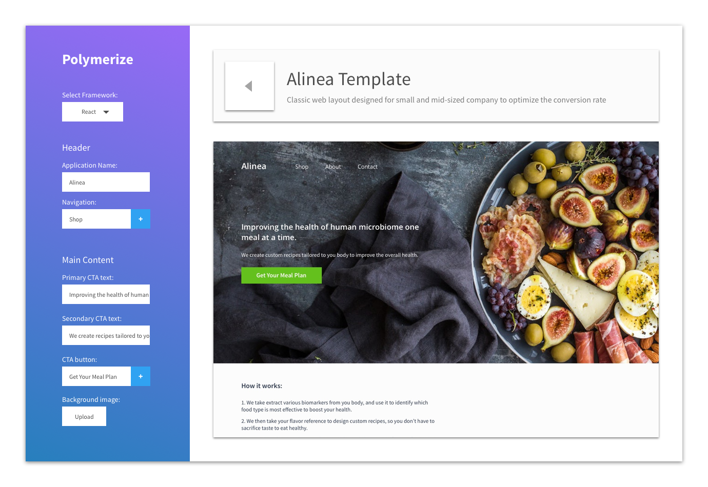

# PolymerizeJS
PolymerizeJS is the Squarespace for React developers.


## Get the template
These are light weight templates are composed of pre designed components. 


Provide the basic data to create a working application.



## In the boilerplate
For now, the basic template come with React, Redux, Eslint, Jest, Webpack.

## After downloading the file
Run:
```
yarn install
```
and open `index.html` in the root directory.

## Roadmap
1. Add routing configuration
2. Create a configurable Node server
2. Allow dynamic drag and drop
3. Support multiple framework

## Contribution
Welcome any engineering and design suggestion.

## License
MIT
